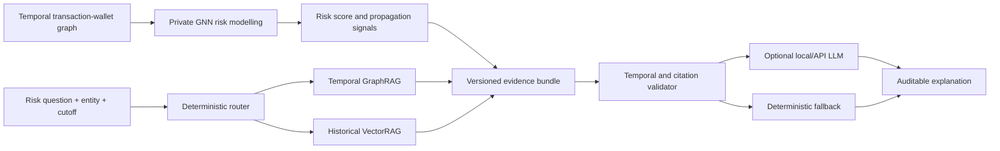

# Hybrid GraphRAG & Temporal Graph Risk Intelligence

An evidence-grounded research prototype for temporal financial-risk analysis over transaction-wallet graphs. The private research pipeline combines temporal graph neural networks (GNNs), VectorRAG, GraphRAG and evidence-bounded LLM generation to support risk prediction, propagation analysis and auditable investigation.

> This is a portfolio-safe public edition of an ongoing MSc dissertation. It contains synthetic examples only and intentionally excludes unpublished results, real financial records, model checkpoints, tuned hyperparameters and dissertation text.

## Research objective

The research system separates four responsibilities:

1. **GNN risk modelling** — temporal node representation, transaction- and unseen-wallet-level prediction, and community-aware risk-propagation analysis under strict temporal and entity-disjoint protocols.
2. **GraphRAG evidence retrieval** — time-valid wallet-transaction-wallet paths plus supporting and counter-evidence.
3. **VectorRAG case retrieval** — historically available numerical analogues, kept distinct from real transaction edges.
4. **Grounded LLM explanation** — citation-aware natural-language reports generated from validated evidence rather than hidden labels.

The GNN answers *how risk is modelled and propagated*; GraphRAG and VectorRAG answer *which evidence can be retrieved*; the LLM answers *how that evidence can be communicated*. This separation prevents a fluent explanation from being mistaken for predictive performance.

## Public architecture



Vector similarity and graph connectivity remain separate: a similar historical case is not treated as a transfer edge.

## Role of the GNN

The GNN is the predictive and propagation layer of the private dissertation pipeline. It is intended to learn temporally valid wallet and transaction representations, evaluate previously unseen wallets, and model how risk signals may diffuse within graph communities. Its outputs are treated as model signals rather than self-explanatory evidence.

GraphRAG complements the GNN by retrieving inspectable paths and subgraphs that can support or challenge a risk assessment. VectorRAG contributes historical analogues, while the generation layer turns only validated evidence into readable explanations. The public repository currently demonstrates the retrieval, evidence-contract and generation interfaces; full GNN training code, checkpoints, tuned configurations and unpublished results remain private during the research phase.

## What the demo can answer

- Which time-valid paths connect a wallet to historically known risk evidence?
- Which paths provide counter-evidence?
- Which earlier cases are numerically similar?
- Which edges or labels were unavailable at the query cutoff?
- Which evidence identifiers support each generated statement?

## Safeguards

- Every edge and label has an observation or availability time.
- Future information is rejected at retrieval and validation time.
- Path direction and node type are preserved.
- Supporting evidence and counter-evidence are reported separately.
- Generated claims cite evidence identifiers or abstain.
- Association is never presented as proof of criminal intent or causality.

## Quick start

```bash
python -m venv .venv
python -m pip install -e .
financial-graphrag demo
```

The default demo uses synthetic wallets and transactions and requires only the Python standard library. An OpenAI-compatible local endpoint can optionally be enabled for evidence-bounded generation.

## Repository structure

```text
docs/       architecture, methodology and disclosure boundaries
examples/   synthetic graph and historical cases
src/        retrieval, evidence validation, generation and pipeline code
tests/      temporal leakage, path direction and citation tests
```

Run validation with:

```bash
python -m unittest discover -s tests -v
```

## Research boundaries

The public repository does not contain Elliptic++ data, real identifiers, exact benchmark scores, split manifests, frozen-test predictions, dissertation figures, unpublished ablations or complete private experiment configurations. Ongoing private work includes temporal and heterogeneous GNN modelling, unseen-wallet evaluation, community-aware GraphRAG retrieval and GNN-based risk-propagation analysis.

## Responsible use

This project is an academic decision-support prototype. A retrieved path or model signal is not proof that a person or wallet is involved in illegal activity. Real deployment would require verified provenance, calibration, legal review, human investigation and continuous monitoring.

## Author

**Jade Lian (JiaQi)**  
MSc Data Science and Analytics, The Hong Kong Polytechnic University  
GitHub: [lianjiaqi323-del](https://github.com/lianjiaqi323-del)
