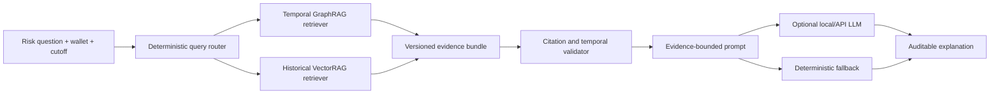

# GraphRAG-based Financial Risk Intelligence System

[](https://www.python.org/)
[](#quality-and-safety)
[](#research-status)

An evidence-grounded research prototype for financial risk investigation over
temporal transaction graphs. The system combines:

- **GraphRAG** for query-driven, time-valid path retrieval;
- **VectorRAG** for comparable historical cases;
- an auditable evidence contract for every retrieved fact;
- optional **OpenAI-compatible LLM generation** for readable explanations;
- deterministic fallback generation when no LLM is available.

The prototype is designed around a simple principle:

> A risk score tells an investigator **how much** risk is estimated; GraphRAG
> shows **where the supporting and counter-evidence paths are**; an LLM explains
> **why those paths matter without inventing facts**.

## Portfolio-safe public edition

This repository is a sanitized engineering demonstration derived from an
ongoing MSc dissertation project. It intentionally contains:

- synthetic wallets, transactions, labels, and amounts;
- no Elliptic++ raw data or redistributed dataset samples;
- no unpublished thesis results, model checkpoints, frozen-test predictions,
  tuned hyperparameters, or dissertation source;
- no real wallet identifiers, API keys, private paths, or personal data.

The public code demonstrates system design and software implementation, not a
claim of production readiness or financial-crime attribution.

## What the demo can answer

Given a synthetic wallet and a query-time cutoff, the pipeline can answer:

1. Which time-valid multi-hop fund-flow paths connect this wallet to a
   historically known high-risk entity?
2. Which paths lead to historically known low-risk entities and therefore act
   as counter-evidence?
3. Which earlier historical cases are numerically similar?
4. Which edges or labels were excluded because they were only visible after the
   query time?
5. Which evidence IDs support each generated statement?

## Architecture



Graph retrieval and vector similarity remain separate by design. A
vector-similar wallet is a historical analogue, **not** a financial-transfer
edge.

## Quick start

The core demo uses only the Python standard library.

```bash
python -m venv .venv

# Windows
.venv\Scripts\activate

# macOS / Linux
source .venv/bin/activate

python -m pip install -e .
financial-graphrag demo
```

Or run it directly:

```bash
python -m financial_graphrag.cli demo
```

The command prints a structured evidence bundle and a readable explanation for
the synthetic wallet `wallet_query` at time step `8`.

## Example explanation

```text
Assessment scope: structural association evidence available by time step 8.

Supporting path [G-PATH-001]: wallet_query -> tx_105 -> wallet_alt_bridge ->
tx_106 -> wallet_watchlist. The endpoint had a historically known high-risk
label by the query cutoff.

Counter-evidence path [G-PATH-002]: wallet_query -> tx_103 -> wallet_merchant.
The endpoint had a historically known low-risk label by the query cutoff.

Historical analogue [V-CASE-001]: case_risky_02 was retrieved as a similar
earlier case.

This output is decision support, not proof of criminal intent or causal risk
transmission.
```

Exact evidence ordering is produced by the current deterministic scoring rules
and may differ when retrieval settings change.

## Optional LLM generation

The repository supports an OpenAI-compatible `/chat/completions` endpoint,
including locally hosted models. No provider is required for the default demo.

```bash
set LLM_BASE_URL=http://127.0.0.1:1234/v1
set LLM_MODEL=local-instruct-model
set LLM_API_KEY=local
financial-graphrag demo --use-llm
```

On macOS or Linux, replace `set` with `export`.

The LLM receives only the validated evidence bundle. If the endpoint is
unavailable or returns an invalid response, the pipeline fails closed to the
deterministic explanation.

## Repository structure

```text
.
|-- docs/
|   |-- ARCHITECTURE.md
|   |-- METHODOLOGY.md
|   |-- PRIVACY_AND_RESEARCH_BOUNDARIES.md
|   `-- neo4j_schema.cypher
|-- examples/
|   |-- historical_cases.json
|   `-- synthetic_graph.json
|-- src/financial_graphrag/
|   |-- cli.py
|   |-- evidence.py
|   |-- generation.py
|   |-- graph_store.py
|   |-- models.py
|   |-- pipeline.py
|   |-- retrieval.py
|   `-- vector_retrieval.py
`-- tests/
    `-- test_pipeline.py
```

## Methodological safeguards

- Every graph edge must have an observation time.
- Evidence later than the query cutoff is rejected.
- Endpoint labels are usable only if their label-availability time is no later
  than the query cutoff.
- Direction and node type are preserved in every path.
- Supporting and counter-evidence are returned separately.
- Generated statements cite evidence IDs or explicitly abstain.
- Structural association is never described as proven causality.

See [METHODOLOGY.md](docs/METHODOLOGY.md) for the research protocol and
[PRIVACY_AND_RESEARCH_BOUNDARIES.md](docs/PRIVACY_AND_RESEARCH_BOUNDARIES.md)
for the disclosure policy.

## Quality and safety

Run the test suite:

```bash
python -m unittest discover -s tests -v
```

The tests cover temporal leakage, label availability, path direction, evidence
validation, historical-case retrieval, and deterministic generation.

## Research status

Implemented in this public prototype:

- typed wallet-transaction graph schema;
- temporal path retrieval with path-level provenance;
- supporting and counter-evidence paths;
- historical numeric case retrieval;
- evidence validation and exclusion notices;
- deterministic routing and explanation;
- optional evidence-bounded LLM generation;
- Neo4j schema example and automated tests.

Active dissertation work, intentionally not disclosed here:

- full Elliptic++ experimental data and provenance manifests;
- frozen temporal benchmarks and statistical comparisons;
- learned graph risk inference with GNNs;
- community-aware retrieval and risk diffusion experiments;
- human evaluation of explanation usefulness;
- unpublished hyperparameters, ablations, and thesis conclusions.

## Responsible-use statement

This project is an academic decision-support prototype. A retrieved path or
model signal must not be treated as proof that a person or wallet is engaged in
illegal activity. Real deployment would require verified data provenance,
calibration, legal review, human investigation, and continuous monitoring.

## Author

**Jade Lian (JiaQi)**  
MSc Data Science and Analytics, The Hong Kong Polytechnic University  
GitHub: [lianjiaqi323-del](https://github.com/lianjiaqi323-del)
