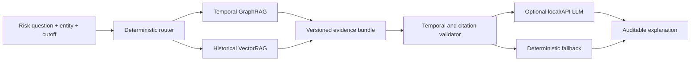

# Hybrid GraphRAG & Temporal Graph Risk Intelligence

An evidence-grounded research prototype for temporal financial-risk analysis over transaction-wallet graphs. The project combines strict temporal modelling, graph learning, VectorRAG, GraphRAG and optional local LLM generation to support auditable risk investigation.

> This is a portfolio-safe public edition of an ongoing MSc dissertation. It contains synthetic examples only and intentionally excludes unpublished results, real financial records, model checkpoints, tuned hyperparameters and dissertation text.

## Research objective

The private research system separates three responsibilities:

1. **Risk prediction** — transaction- and unseen-wallet-level modelling under strict temporal and entity-disjoint protocols.
2. **Graph evidence retrieval** — time-valid wallet-transaction-wallet paths, supporting and counter-evidence, and historical analogues.
3. **Grounded explanation** — citation-aware natural-language reports generated from validated evidence rather than hidden labels.

This separation prevents a fluent explanation from being mistaken for predictive performance.

## Public architecture



Vector similarity and graph connectivity remain separate: a similar historical case is not treated as a transfer edge.

## What the demo can answer

- Which time-valid paths connect a wallet to historically known risk evidence?
- Which paths provide counter-evidence?
- Which earlier cases are numerically similar?
- Which edges or labels were unavailable at the query cutoff?
- Which evidence identifiers support each generated statement?

## Safeguards

- Every edge and label has an observation or availability time.
- Future information is rejected at retrieval and validation time.
- Path direction and node type are preserved.
- Supporting evidence and counter-evidence are reported separately.
- Generated claims cite evidence identifiers or abstain.
- Association is never presented as proof of criminal intent or causality.

## Quick start

```bash
python -m venv .venv
python -m pip install -e .
financial-graphrag demo
```

The default demo uses synthetic wallets and transactions and requires only the Python standard library. An OpenAI-compatible local endpoint can optionally be enabled for evidence-bounded generation.

## Repository structure

```text
docs/       architecture, methodology and disclosure boundaries
examples/   synthetic graph and historical cases
src/        retrieval, evidence validation, generation and pipeline code
tests/      temporal leakage, path direction and citation tests
```

Run validation with:

```bash
python -m unittest discover -s tests -v
```

## Research boundaries

The public repository does not contain Elliptic++ data, real identifiers, exact benchmark scores, split manifests, frozen-test predictions, dissertation figures, unpublished ablations or complete private experiment configurations. Ongoing private work includes heterogeneous graph learning, unseen-wallet evaluation, community-aware retrieval and risk-propagation analysis.

## Responsible use

This project is an academic decision-support prototype. A retrieved path or model signal is not proof that a person or wallet is involved in illegal activity. Real deployment would require verified provenance, calibration, legal review, human investigation and continuous monitoring.

## Author

**Jade Lian (JiaQi)**  
MSc Data Science and Analytics, The Hong Kong Polytechnic University  
GitHub: [lianjiaqi323-del](https://github.com/lianjiaqi323-del)
